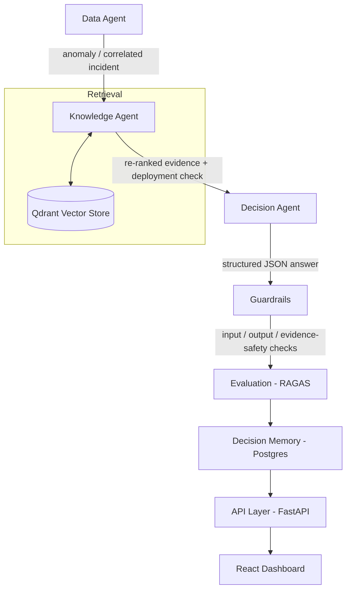

# InsightOS

**An autonomous business-intelligence system that detects anomalies in company data, investigates root causes using an LLM-powered multi-agent pipeline, and grounds every answer in retrieved evidence rather than model guesswork.**

Given a drop in revenue, InsightOS doesn't just chart the number — it correlates it against other metrics, checks whether a recent deployment could be responsible, retrieves relevant support tickets and reviews, and produces a cited, confidence-scored explanation. Every answer passes through a guardrails layer before a user ever sees it.

---

## Why this project exists

Most "AI dashboard" demos wire a chatbot on top of a database and call it done. InsightOS was built to answer a harder question: **how do you make an LLM's output trustworthy enough to act on in a business context** — not just fluent, but evidenced, checked, and honest about its own uncertainty?

That question shapes every architectural decision below.

---

## Architecture



**Data Agent** — runs anomaly detection (Isolation Forest for point anomalies, slope-based trend detection) across every business metric independently, then checks whether multiple metrics moved together in the same window. If they did, it bundles them into a single correlated **incident** rather than reporting three unrelated alerts for what is actually one problem.

**Knowledge Agent** — over-fetches candidate evidence from Qdrant, then re-ranks it with a weighted blend of similarity, recency, and source reliability (`0.60·similarity + 0.25·recency + 0.15·reliability`) — so an old-but-textually-similar ticket doesn't beat a new, more relevant one just because it happens to share more keywords. It also runs a **targeted, non-semantic lookup** against the deployment log for anything that shipped shortly before the anomaly — a structural fact-check, not a similarity guess — and tags that evidence distinctly (`temporal_signal` vs `semantic_match`) so the reasoning layer can weigh a confirmed fact differently from a wording match.

**Decision Agent** — an LLM call constrained to return structured JSON (root cause, evidence used, confidence, recommendation), explicitly instructed to treat `temporal_signal` evidence as stronger causal signal than ordinary retrieval matches, and to say "not enough evidence" rather than guess when the evidence is thin.

**Guardrails** — a genuinely separate layer, not prompt instructions bolted onto the Decision Agent. Three categories: input safety (jailbreak/injection/off-topic detection via an LLM self-check), output safety (unsupported certainty, missing evidence, invalid confidence — all fast structural checks, no LLM call needed), and **evidence safety** — the category I consider most important: does the claimed evidence actually exist, is stale evidence being presented as current, is a deployment being blamed without a real temporal match backing it up.

**Evaluation** — every decision is scored post-hoc with RAGAS (faithfulness: is the answer grounded in the retrieved evidence; relevancy: does it actually address the question), so answer quality is measured, not assumed.

---

## Engineering notes worth reading

A few of the harder problems this project actually forced me to solve, since they're more representative of the work than "it renders a chart":

- **A single `NaN` silently corrupted a database row and took down three unrelated endpoints days later.** RAGAS's relevancy metric can legitimately return `NaN` for a degenerate answer; nothing stopped that from being saved as a real float. `NaN` is a valid Python value but invalid JSON — so `/dashboard`, `/history`, and `/recommendations` all started throwing 500s on unrelated requests, days after the row that caused it was written. Fixed at the source (sanitize before saving) and defensively everywhere the value is read (a NaN-safe check, since `x is not None` doesn't actually catch NaN — `NaN is not None` evaluates `True`).
- **A guardrail that looked like it was working wasn't.** The input-safety check was silently failing on every single call — a library version mismatch meant the underlying LLM call crashed internally every time, and the failure was being swallowed and replaced with a generic error message that never matched the code's refusal-detection string. The guardrail had effectively been a no-op the entire time, with no error to signal it.
- **Correlated incidents were reasoned about correctly but persisted incorrectly.** The Decision Agent's LLM call correctly received and reasoned over a multi-metric incident — but a separate code path responsible for *saving* the decision independently re-derived its input from an earlier pipeline stage, silently reverting multi-metric incidents back to single-metric anomalies before they hit the database. The bug was invisible in the API response text (the LLM's prose still mentioned both metrics) and only surfaced by inspecting the structured data underneath it.

---

## Tech stack

| Layer | Choice |
|---|---|
| API | FastAPI |
| Orchestration | LangGraph |
| LLM Gateway | LiteLLM (Groq, with provider-agnostic fallback) |
| Vector store | Qdrant |
| Relational store | PostgreSQL |
| Guardrails | NeMo Guardrails |
| Evaluation | RAGAS (faithfulness, answer relevancy) |
| Scheduling | APScheduler |
| Observability | Logfire (LLM calls, SQL, HTTP, all traced) |
| Frontend | React (Vite) |

---

## Project structure

```
Backend/
  app/
    agents/            data_agent, knowledge_agent, decision_agent, report_agent, graph.py (LangGraph wiring)
    routers/            dashboard, recommendations, history, upload, reports
    guardrails.py        input / output / evidence-safety checks
    reranker.py           similarity + recency + reliability blending
    evaluation.py          RAGAS scoring
    memory.py               decision persistence + duplicate detection
    scheduler.py              hourly automatic pipeline run
  tests/
Frontend/
  src/
    pages/               Dashboard, Ask, History, Upload
    components/
```

---

## Running it locally

```bash
docker compose up -d postgres qdrant
cd Backend
pip install -r requirements.txt
cp .env.example .env   # add your GROQ_API_KEY
uvicorn app.main:app --reload
python -m app.seed_data
python -m app.sync_vector_store
```

```bash
cd Frontend
npm install
cp .env.example .env
npm run dev
```

API docs at `http://localhost:8000/docs`. Frontend at `http://localhost:5173`.

---

## API overview

| Method | Path | Description |
|---|---|---|
| GET | `/dashboard` | Revenue trend, alert count, evaluation metrics, resolution rate |
| POST | `/recommendations/run-now` | Manually trigger the full detection → investigation pipeline |
| POST | `/recommendations/ask` | Ask an on-demand question, same reasoning pipeline |
| GET | `/history` | Every past decision |
| POST | `/history/{id}/outcome` | Mark a decision resolved / false positive / ignored |
| GET | `/reports/weekly` | Recurring-pattern and resolution summary over N days |
| POST | `/upload` | Add a PDF document to the searchable evidence base |

---

